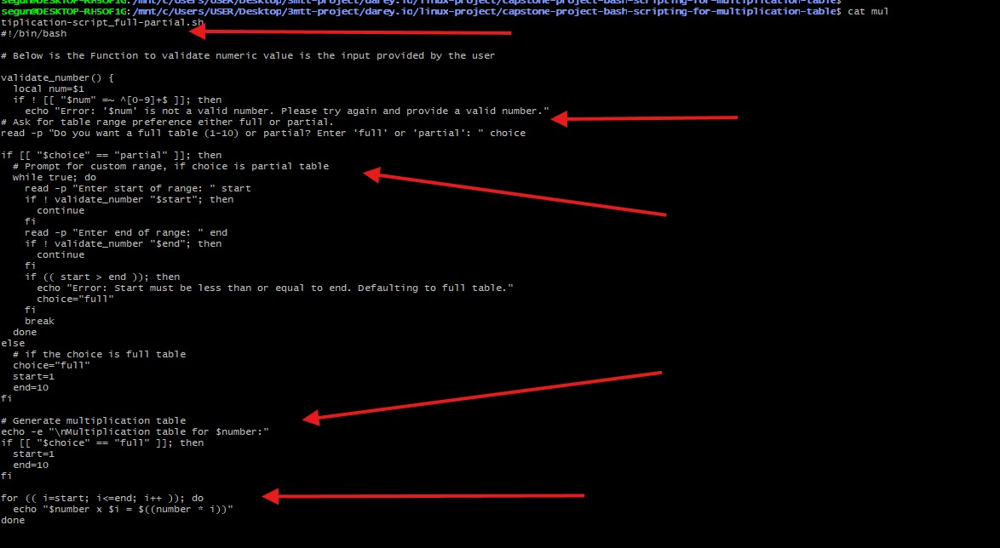
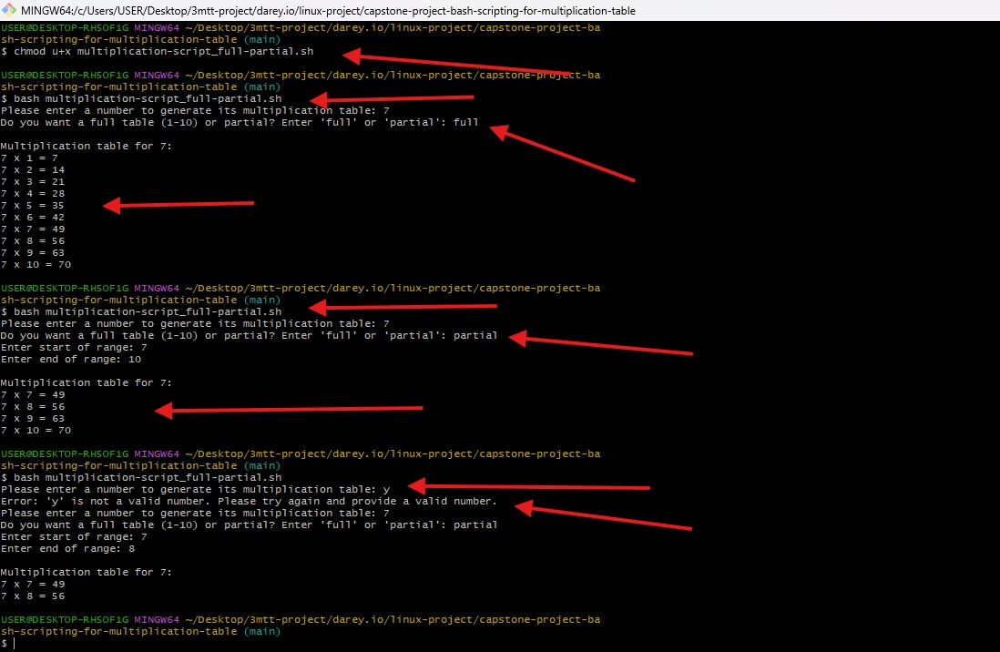
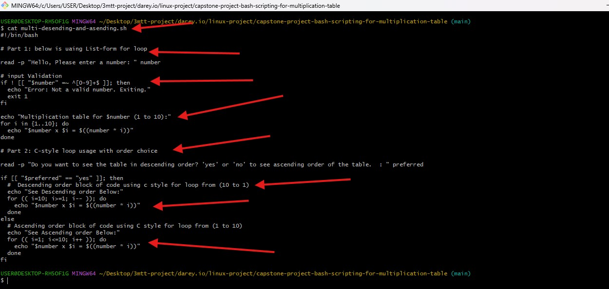
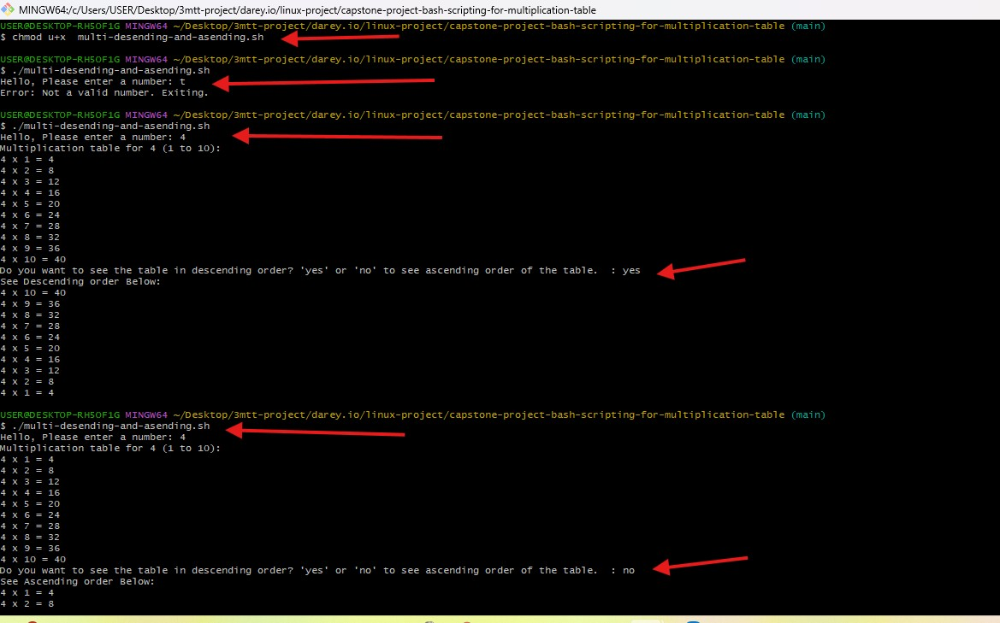

#   Capstone Project Bash Scripting for Multiplication Table 

## Readme URL Below: 

https://github.com/Agbedeyisegun/3mtt-project/blob/main/darey.io/capstone-project-bash-scripting-for-multiplication-table/README.md

## Below are the screenshots of the steps.

- Step 1 
Screenshot of script called "multiplication-script_full-partial.sh" this script is check if numeric value is provided for the table, if not ask the user to provide it, the is used to handle arguement. 
Prompts the user to choose between generating a full multiplication table (1–10) or a partial table with a custom range.
Then ask the user if it is partial or full multipication table value should be provided with using if else statement. also this script handle error, out of range input.  
Finally, it displays the multiplication table for the chosen number over the selected range.
The script is run with `bash multiplication-script_full-partial.sh`.

Step 2 – Screenshot of Full/Partial Multiplication Table Script Execution
This screenshot shows how the user ran the script called multiplication-script_full-partial.sh. The script starts by checking if the number entered is valid (a numeric value). If not, it asks usre to enter a proper number.
Next, it asks whether the user want a full multiplication table (from 1 to 10) or a partial one, where the user can choose the start and end values. The script uses if-else statements to manage that choice.
If the values enter for the partial range don’t make sense—like the start number being bigger than the end—the script detects it and automatically defaults to the full table instead. Finally, it shows the multiplication results based on the choice made by the user.
below are the cmd used:
`bash multiplication-script_full-partial.sh`, `chmod u+x multiplication-script_full-partial.sh
`.

Step 3 – Script Execution Showing Ascending and Descending Multiplication Table Options
This screenshot captures the execution of the script named "multi-desending-and-asending.sh". The script begins by asking the user to enter a number and uses input validation to make sure the input is a numeric value. If a non-numeric value is entered, the script displays an error message and exits.
Once a valid number is provided, the script initially shows the multiplication table for that number from 1 to 10 using a list-form for loop.
After that, it asks the user whether they want to view the table in descending or ascending order. Based on the user's input (yes for descending, or any other response for ascending), the script uses a C-style for loop to display the multiplication table accordingly:
- If “yes” is entered: the table is displayed from 10 down to 1.
- If any other input is given: the table is shown again from 1 to 10.
The logic includes:
- Input validation using if condition and regex.
A list-form loop for the first table display.
B C-style loop with dynamic control flow for the second display.
Clear output labeling for both ascending and descending table views.
The script is run using:
bash multi-desending-and-asending.sh
This step proves that the script correctly handles user interaction and uses multiple loop types to fulfill the task.

Step 4 – Script Execution with User Input and Multiplication Table Output
This screenshot shows the user running the Bash script multi-desending-and-asending.sh from the terminal using the following command:
"bash multi-desending-and-asending.sh"
The script starts by asking the user to enter a number. In this case, the user inputs a valid numeric value. The script then displays the multiplication table from 1 to 10 using a list-form for loop.
Next, the script asks whether the user wants to see the multiplication table in descending order. If the user types yes, the script runs a C-style for loop to display the table from 10 down to 1. If the user types anything else (like no), the table is shown again in ascending order using another for loop, starting from 1 up to 10.
The script includes:
Input validation using regular expression and if condition.
Two types of loops: list-form and C-style.
Logic to handle both ascending and descending display based on user input.
The output clearly shows that the script works properly and responds to the user's choice, demonstrating how interactive Bash scripts can respond dynamically to input.

