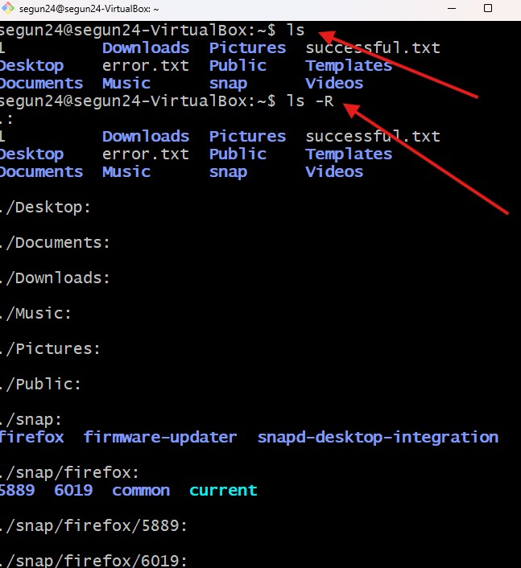

#   Mini Project Basic linux Commands

## Readme URL Below: 

https://github.com/Agbedeyisegun/3mtt-project/tree/main/darey.io/linux-project/mini-project-basic-linux-commands#readme

## Below are the screenshots of the steps.

- Step 1 
Screenshot of my connection from git_bash to Ubuntu 24.04.2 LTS linux machine with cmd below: `ssh segun24@segun24-VirtualBox`.

- Step 2 
Screenshot of my permission denied situation when creating with file in a secure path cmd below: `touch` .

- Step 3 
Screenshot of my permission allowed situation when creating with file in a secure path with "sudo" which is "superuser do" privilege cmd below: `sudo touch`.

- Step 4
Screenshot of creating directory in root directory, listing and grepping to control the output and comfirmation of the output given cmd below: `sudo touch /segun` `ls / | grep segun`.

- Step 5
Screenshot of printing working directory, installation of tree to show how linux is working with tree like form with "/" as the highest level, different from windows that uses "c" or "d" folder respectively. i use 'L 1' to control that i just wanted only the first level cmd below: `pwd` `tree -L 1`.

- Step 6
Screenshot of navigating to root directory with practising of various commands below: `pwd` to check where i am `cd /` to move to root directory, using "tab tab" when i press `cd b`to suggest the "bin" directory so i have idea where to move in other to play around with the commands.

- Step 7
Screenshot of listing "ls" with flags to show more information of the roots directories, info like permission, size, and date among others with below cmd `ls -l`.

- Step 8
Screenshot of make and list directory and directories at the same time with grep to control the output below are cmd `sudo mkdir /usr/photos`, `ls /usr/ | grep photos` `sudo mkdir dir1 dir2 dir3`  and `ls`. 

- Step 9
Screenshot of list with '-R' flags for showing directory recursively with below cmd: `ls` and `ls -R`. 

- Step 10
Screenshot of list with '-lh' '-a' flags to give human readable format like size in k instead of bytes  and all with hidden file(s) and director(ies) to include file(s) or director(ies) start or prefix with "." below cmd: `ls -lh` and `ls -a`. 

- Step 11
Screenshot of cat which concatenate means to read or output the content of a file(s), copy to copy file(s) and change the name of a file and directory in linux with below cmd: `cat /etc/os-release` and `cp` for duplicating and renaming of file and directory with evidence in the file.  

- Step 12
Screenshot of copy and remove commands with some flags also move commands, below are the cmds `cp -R` to copy all the content recursively, `rm -rf` for removing file(s) and director(ies), the cmd `rmdir` also remove directory but not file(s) but `rm` remove both file(s) and director(ies) without issue so "rm" is more in use also `mv` commands is used to move and rename file(s) and director(ies).  

 

- Step 13
Screenshot of touch and find commands with some flags, below are the cmds `touch segun.txt` to create file called segun with 'txt' as the extension in the same directory, and find cmd to find file(s) and director(ies) in specify path with some parameter set like name and type to control the output result(s) of the file(s) and director(ies) with this cmd `sudo find /etc/ -type d -name netplan`.  

 