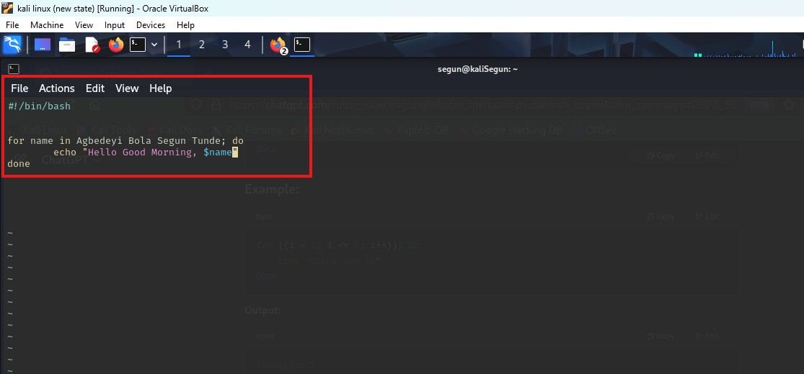
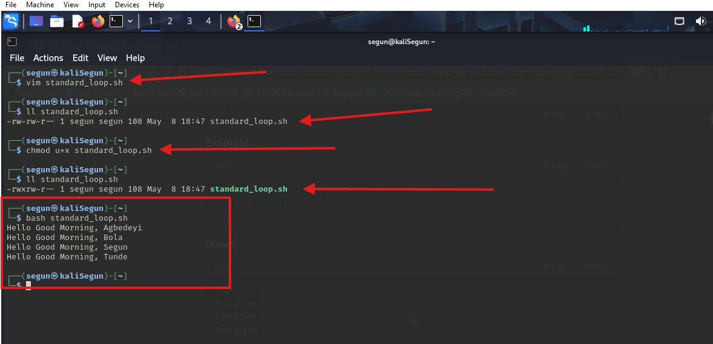
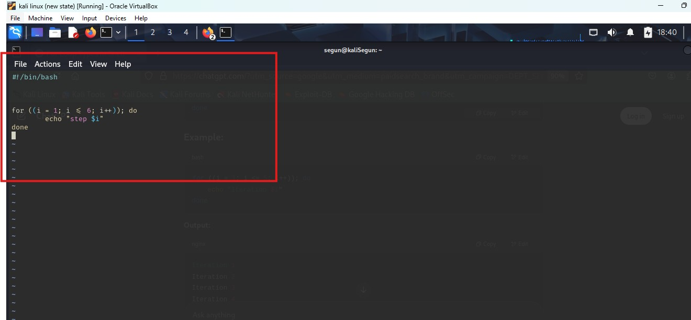
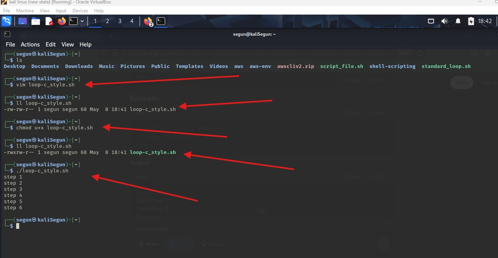
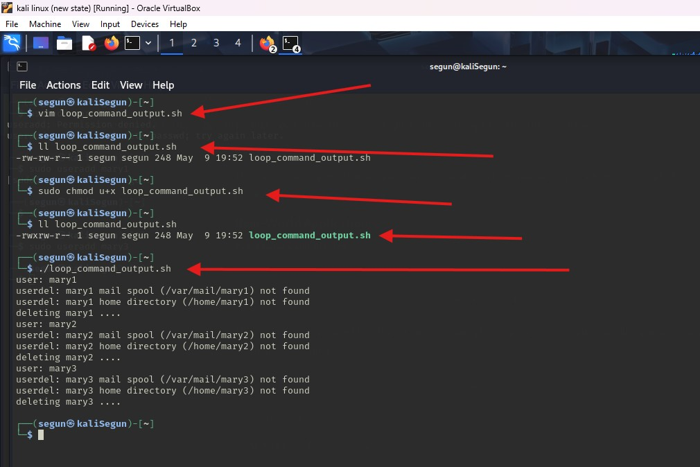
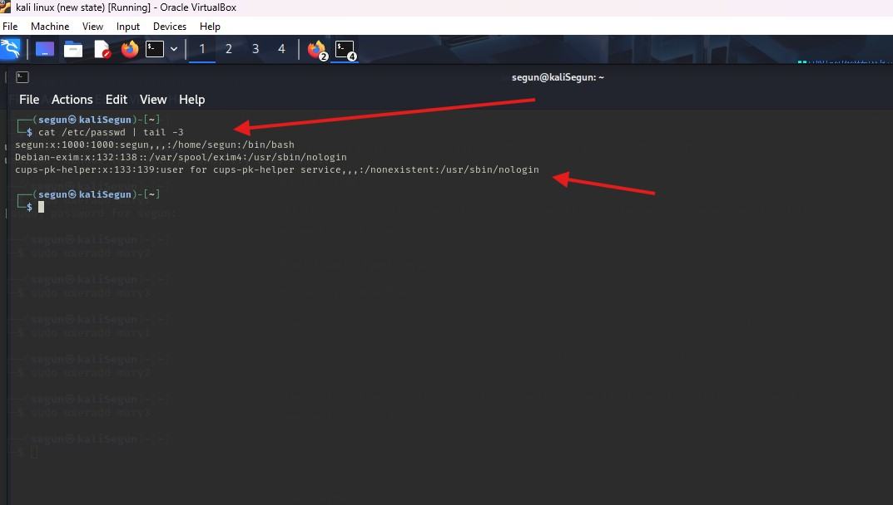

#   Mini Project Control Flow in Shell Scripting

## Readme URL Below: 

https://github.com/Agbedeyisegun/3mtt-project/blob/main/darey.io/linux-project/mini-project-control-flow-in-shell-scripting/README.md

## Below are the screenshots of the steps.

- Step 1 
Screenshot of using vim editor to create for loop standard or list type script that greet 4 people.

- Step 2 
Screenshot of all the commands to create the file check the necessary permissions for of the script and  changing it before running the script and lastly  run the script with bash below are the commands in this process
`vim standard_loop.sh`, `ll standard_loop.sh`, `chmod u+x standard_loop.sh` and `bash standard_loop.sh`

- Step 3 
Screenshot of using vim editor that create for loop c style script that echo step1 to step6 then exit.

- Step 4 
Screenshot of all the commands to create the file, check the necessary permissions of the script and  changing it before running the script and lastly  run the script with bash below are the commands in this process
`vim ./loop-c_style.sh`, `ll ./loop-c_style.sh`, `chmod u+x ./loop-c_style.sh` and `./loop-c_style.sh`
![test standard_loop]

- Step 5 
Screenshot of using vim editor that create for loop over command style script that takes the names of the last 3 users frm the /etc/passwd file, sleep for 2 seconds, then echo to the terminal "deleting users" then exit.

- Step 6 
Screenshot of all the commands that creates the file check the necessary permissions of the script and  changing it before running the script check if the users are there before the execution with bash below are the commands in this process
`vim ./loop_command_output.sh`, `ll ./loop_command_output.sh`, `chmod u+x ./loop_command_output.sh` and `./loop_command_output.sh`

- Step 6 
Screenshot of testing if the script worked cat the /etc/passwd file to if the users are still there or not with `cat /etc/passwd | tail -3`

Below are my Experiences 

loop-c_style.sh - Often good for programmers, good control of index, slightly verbose, less idiomatic in Bash Precise iteration with index

standard_loop.sh - Very readable, simple to use manual list only Small set of known values

loop_command_output.sh - Dynamic, works with command output, word splitting can be problematic, processing command results.

