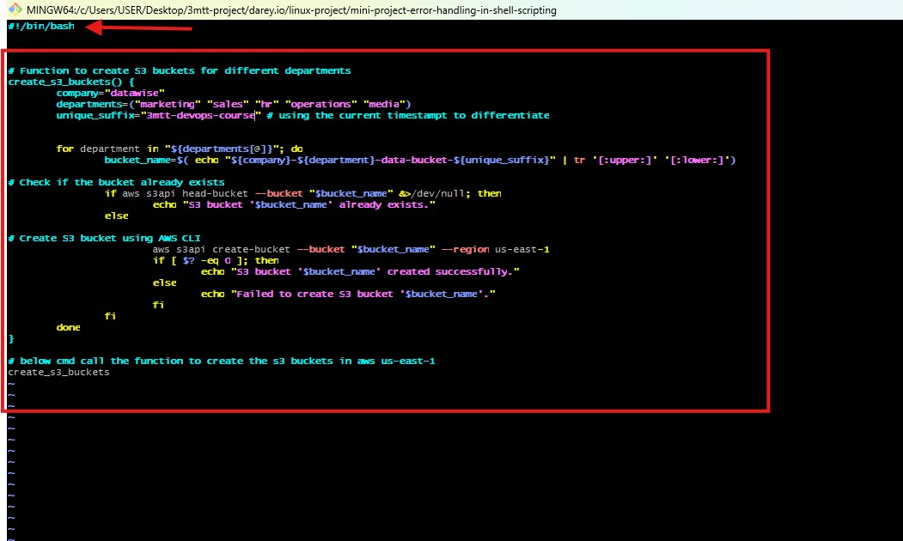
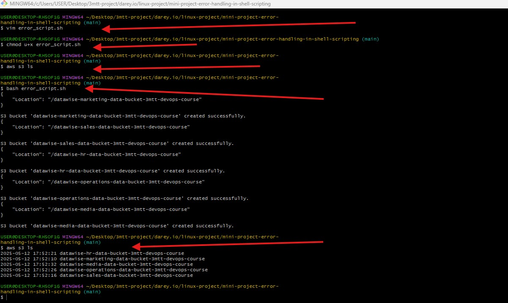
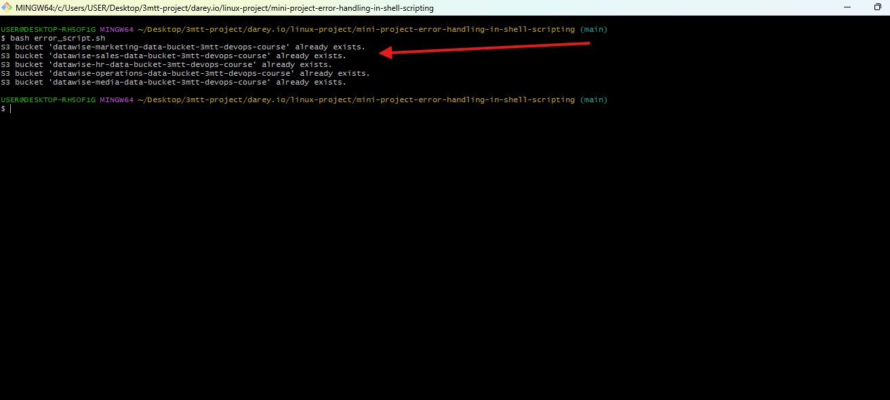

#   Mini Project Error Handling in Shell Scripting 

## Readme URL Below: 

https://github.com/Agbedeyisegun/3mtt-project/blob/main/darey.io/linux-project/mini-project-error-handling-in-shell-scripting/README.md

## Below is a paragraph about my experience on shell scripting so far;

Bash scripting is a powerful tool for automating tasks in Unix-like environments, allowing users to execute multiple commands sequentially and handle complex workflows. It begins with basic script creation using #!/bin/bash, defining variables, and leveraging built-in commands like echo, ll, sleep, do, done and grep and all. Conditionals (if, else, elif) enable decision-making, while loops (for loop and while loop) streamline repetitive tasks such as iterating over files or executing commands a set number of times. Advanced scripting integrates functions for modularity and efficiency, redirections (>, >>, |, 2>, &>) for handling input/output, and background execution (&) for multitasking. By combining these techniques, users automate tasks like system backups, log analysis, file manipulation, and even deployment processes, enhancing productivity and reducing manual effort in development and administration workflows learnt to run the script by using `bash` or `./` change the permission with `chmod` .

- Step 1 
Screenshot of using vim editor to create error handling script that create s3 buckets for company called datawise and create 5 department bucket using '3mtt-devops-course' is the unique identifier, check if the bucket is already existing send the response and error with "&>" to /dev/null directory. Also check for error and success with 'if', 'else' statement. The function is called with cmd `create_s3_buckets`

- Step 2 
Screenshot showed the changed permission for the code to be able to execute, listing of the s3 bucket that exist before the script is ran to be sure the bucket is not existing to makke sure the buckets are not in existent with `aws s3 ls`, run the code with `bash error_script.sh` to see if the code run without error, then check again if the code run and all the bucket is created as planned in the script.

- Step 3
Screenshot of the terminal to show the test of the code block of the script that takes care of the existent of the particular bucket that want to be created before creating it with 'if', 'else' statement. The code checked if the s3 bucket is in existent if yes it will echo 'the name of the particular bucket and says in already exist' when run again with `bash error_script.sh`

