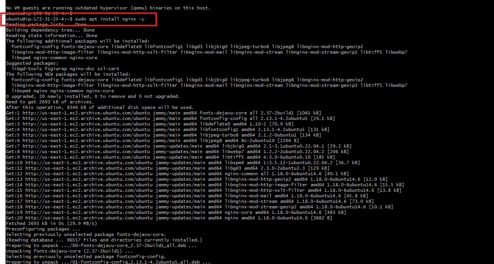

#   Mini Project- linux fundamentals

## Instance URL Below

https://us-east-1.console.aws.amazon.com/ec2/home?region=us-east-1#InstanceDetails:instanceId=i-0df5c19adab7fc1ac

## Below are the screenshots of the steps.

- Step 1 
Screenshot of my aws console home page in us-east-1 region.

- Step 2 
Screenshot of aws console login into us-east-1  region and login to an ec2 instance and running it with key-pair.

- Step 3
Screenshot of aws console showing key pair after creating it for login to an ec2 instance.

- Step 4
Screenshot of key pair after creating it for login to an ec2 instance, change the permission on gitbash ide. change with the cmd below ; `cd`, `ll`, `ls` and `chmod 400`. 

- Step 5
Screenshot of successful connection to the aws ec2 instance using ssh (secure shell) with key pair.

- Step 6
Screenshot of update and upgrade cmd after successful connection.

- Step 7
Screenshot of installation of nginx package to test the ec2 instance on the remote server. with `sudo apt install nginx -y`.

- Step 8
Screenshot of updating and upgrading installation of nginx package, with `sudo apt update` and `sudo apt upgrade -y`.

- Step 9
Screenshot of installation of tree package to test the ec2 instance on the remote server with `sudo apt install tree -y`.

- Step 10
Screenshot of updating and upgrading installation of tree package with `sudo apt update` and `sudo apt upgrade -y`.

- Step 11
Screenshot of confirmation of installation of tree package with `tree / -L 1`.

- Step 12
Screenshot of confirmation of installation of nginx package with `ls`, `cd` cmd.

- Step 13
Screenshot practicing more package installation of vim and docker package with `sudo apt install vim -y`, `sudo apt install docker.io -y` cmd.

- Step 14
Screenshot practicing uninstallation of packages with tree removal with `sudo apt remove tree -y` cmd.

- Step 15
Screenshot of closing and exit from the ec2 instance from the git_bash with `exit` cmd.

- Step 16
Screenshot of closing and exit from the ec2 instance from the git_bash with `exit` cmd.

- Step 17
Screenshot of successful stopping and deletion of the ec2 instance and the storage volume and releasing the ip address associated with it on aws server in us-east-1 region.

- Step 18
Screenshot of temination ec2 instance on aws server in us-east-1 region.

