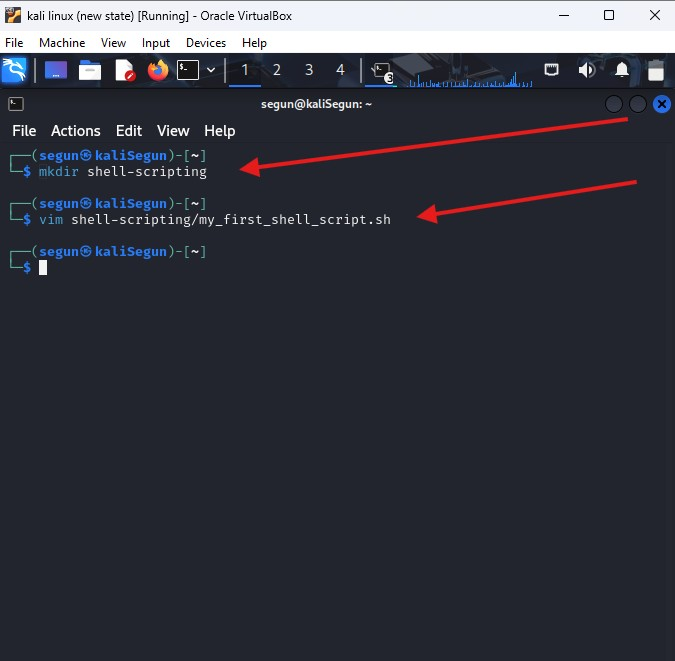
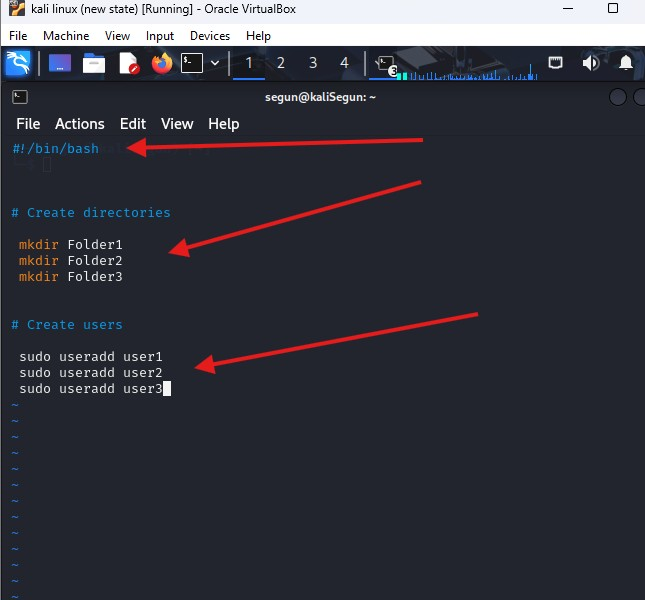
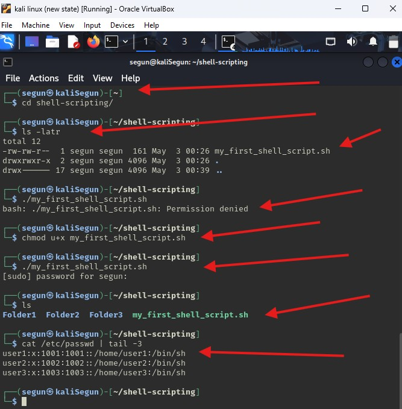
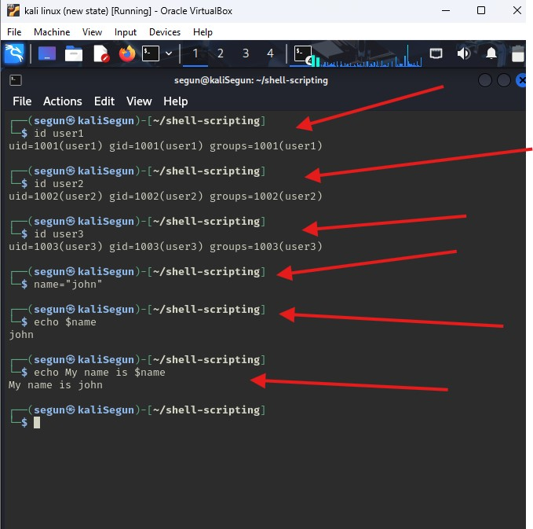

#   Mini Project Linux Shell Scripting 

## Readme URL Below: 

https://github.com/Agbedeyisegun/3mtt-project/blob/main/darey.io/linux-project/mini-project-linux-shell-scripting/README.md

## Below are the screenshots of the steps.

- Step 1 
Screenshot of creating a directory for the script also using vim editor to create the script. below are the cmds used `mkdir shell-scripting`, `vim shell-scripting/my_first_shell_scripting.sh`

- Step 2 
Screenshot of vim editor using used to create the script that will create 3 directories and 3 users. below is the cmd used `vim shell-scripting/my_first_shell_scripting.sh`

- Step 3 
Screenshot of cd into the directory created, ls to list the if the file for the script is created, test if the script will run without execute permission, changed the permission and run the file again if it is okay, then check if the script created 3 directories and 3 users with ls and cat with tail command to see the last 3 users created if it is actually the users just created in the /etc/passwd file. below are the cmd used `cd shell-scripting`, `./my_first_shell_scripting.sh`, `chmod`, `cat`, `pipe` and `tail` respectively.

- Step 4 
Screenshot that check if the script created 3 directories and 3 users using id cmd also creation of variables by assiging john to variable called "name" and calling it with echo cmd, below are the cmd used `id`, `name=john`, and `echo $name` respectively.

