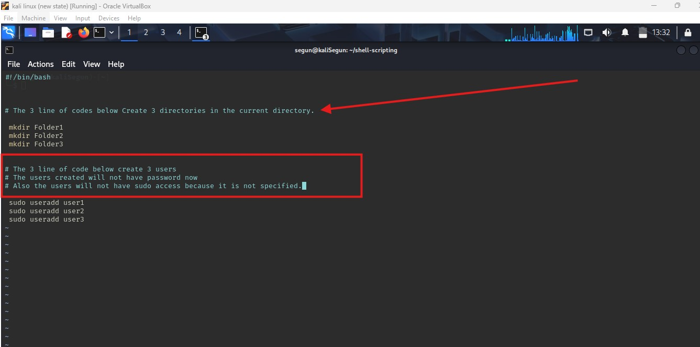

#   Mini Project Linux Shell Scripting Commenting

## Readme URL Below: 

https://github.com/Agbedeyisegun/3mtt-project/blob/main/darey.io/linux-project/mini-project-linux-shell-scripting_commmenting/README.md

## Below is the screenshot.

- Step 1 
Screenshot of single line commenting explaining what the below 3 line of coding is doing.
Also the 2nd set of comment which is multi line comment, explain why the code was used and what it is doing in a multi line comment style. using "#" before the line makes the interpreter to see it as not part of the code in the shell script. 
