#   Mini Project linux Text Editor (VIM and NANO)

Entering Insert Mode: Press i or a to start typing. Ensure that "Hello, this is a Vim hands-on project." is entered as required.

Saving and Exiting:

Save and close: :wq

Quit without saving: :q!

Navigation Commands:

Move left (h), right (l), up (k), down (j).

Editing Features:

Copy (yy), paste (pp), delete (dd), undo (u).

Real-life use case: Vim is commonly used for editing configuration files like /etc/nginx/nginx.conf.

Using Nano Editor
Nano provides an easier interface for text editing:

Opening a File:

bash
nano exercise.txt
Editing and Saving:

Type required text.

Save progress: Ctrl + O, enter new name if necessary.

Exit: Ctrl + X

Editing an Existing File:

Open an existing file using nano filename.txt, make changes, save with Ctrl + O.

Real-life use case: Nano is useful for quick edits, such as updating user credentials in /etc/passwd.
## Readme URL Below: 

https://github.com/Agbedeyisegun/3mtt-project/blob/main/darey.io/linux-project/mini-project-linux-text-editor/README.md

## Below are the screenshots of the steps.

- Step 1 
Screenshot of vim editor cmd for creating a file called "vim exercise" with ".txt" extension format using cmd below: `vim exercise.txt` while several extension too can be used by just using the extension of the program you wanted.

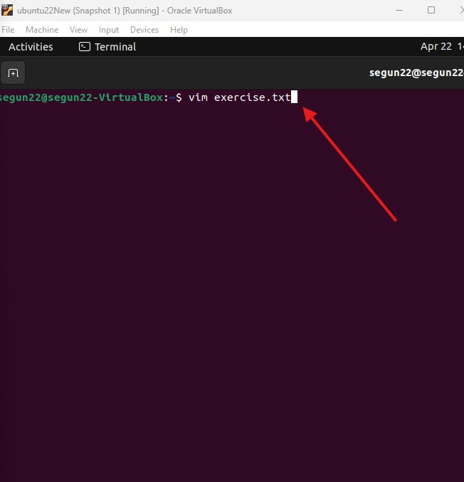

- Step 2 
Screenshot of vim editor in the "insert mode" and "welcome to darey.io"text inside the it.

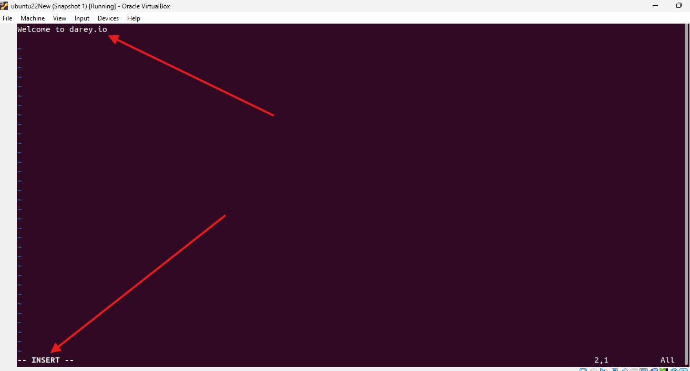

- Step 3 
Screenshot of vim editor using "yy" and "pp" in normal mode to copy and paste the 1 line of "welcome to darey.io"text inside the it and paste severally to demostrate the power it gives user to manipulate text efficiently with 'vi Improved' or VIM.

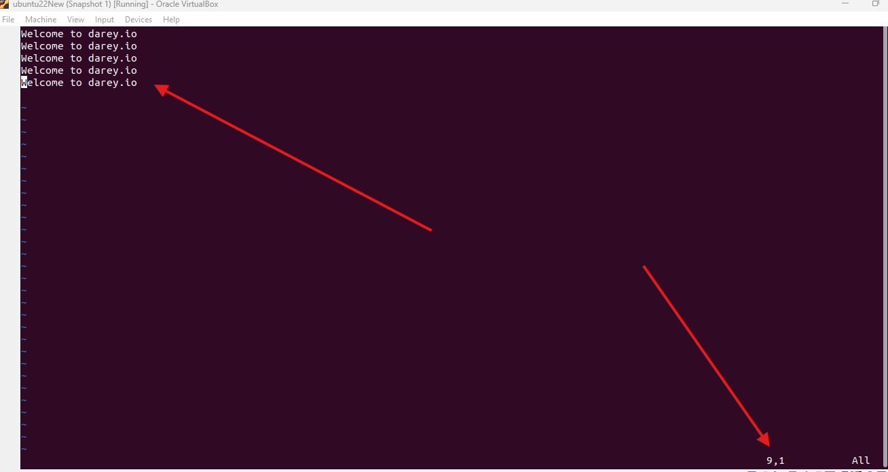

- Step 4 
Screenshot of vim editor using "dd" and "x" in "normal mode" to delete a whole line and character from several "welcome to darey.io" text that was written in "insert mode" to demostrate the power it gives user to manipulate text efficiently with 'vi Improved' or VIM.

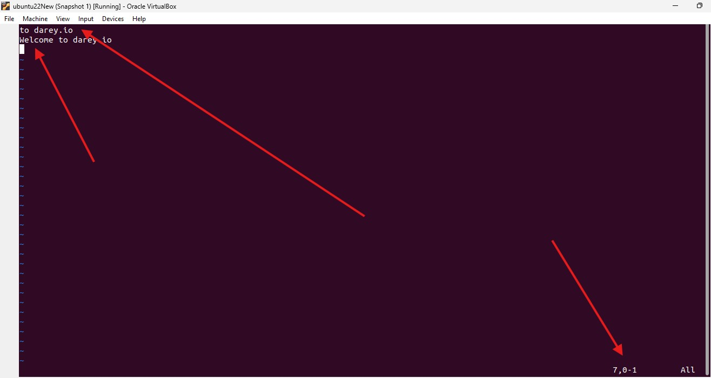

- Step 5 
Screenshot of vim editor using "u" and "hjkl" keys in normal mode to undo and navigate the deleted character from several "welcome to darey.io" text to demostrate the power it gives user to manipulate text efficiently with 'vi Improved' or VIM.

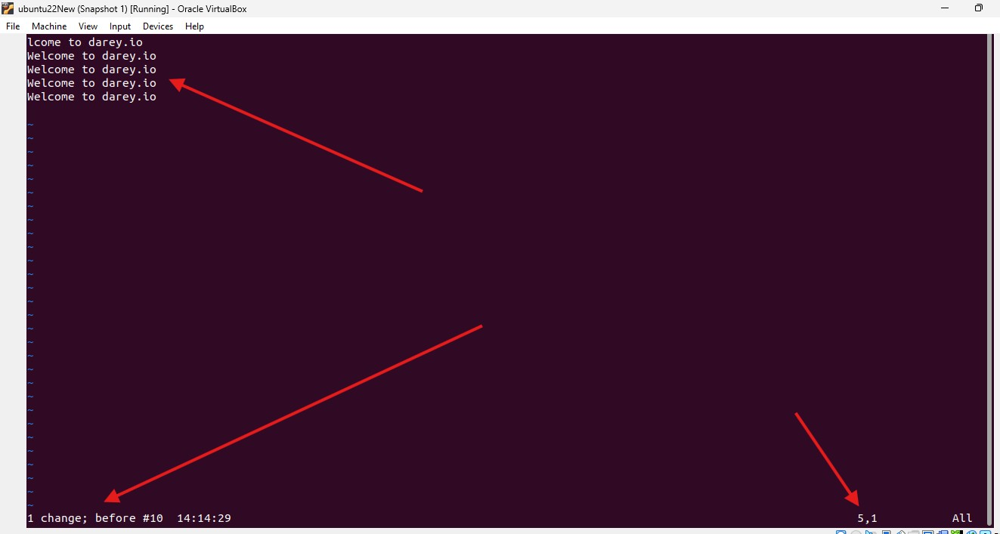

- Step 6 
Screenshot of vim editor save and exit with cmd `:wq` "w" for write "q"  for quit and "enter" to close the 'vi Improved' or VIM.

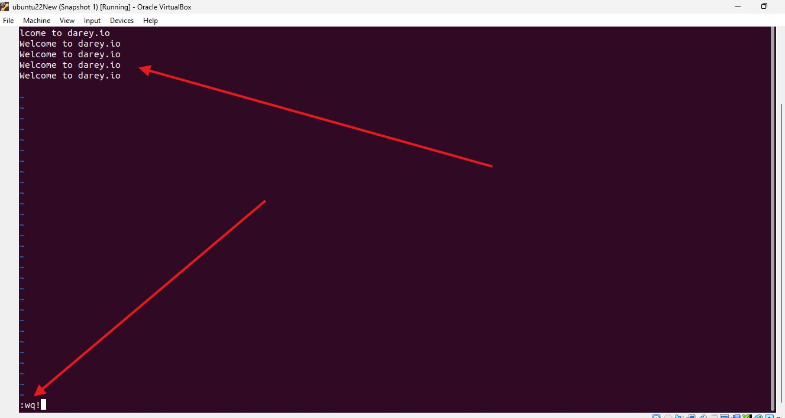

- Step 7 
Screenshot to confirm creation of the file with cmd `ls` from the terminal.

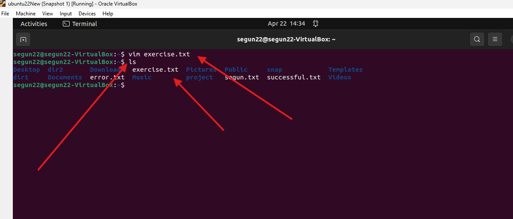

- Step 8 
Screenshot to proof the written text is saved as expected in the file with cmd `cat` from the terminal.

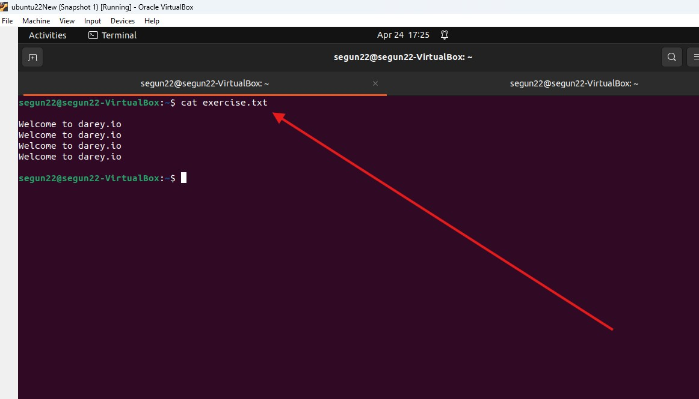

- Step 9 
Screenshot to quit without saving change to the several deletion made to the file with cmd `:q!` from the terminal.

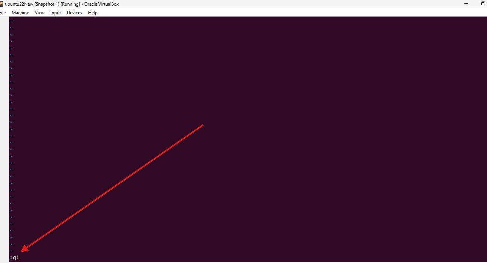

- Step 10 
Screenshot to checked if the quit without saving worked as expected with cmd `:q!` "q" without write from the terminal.

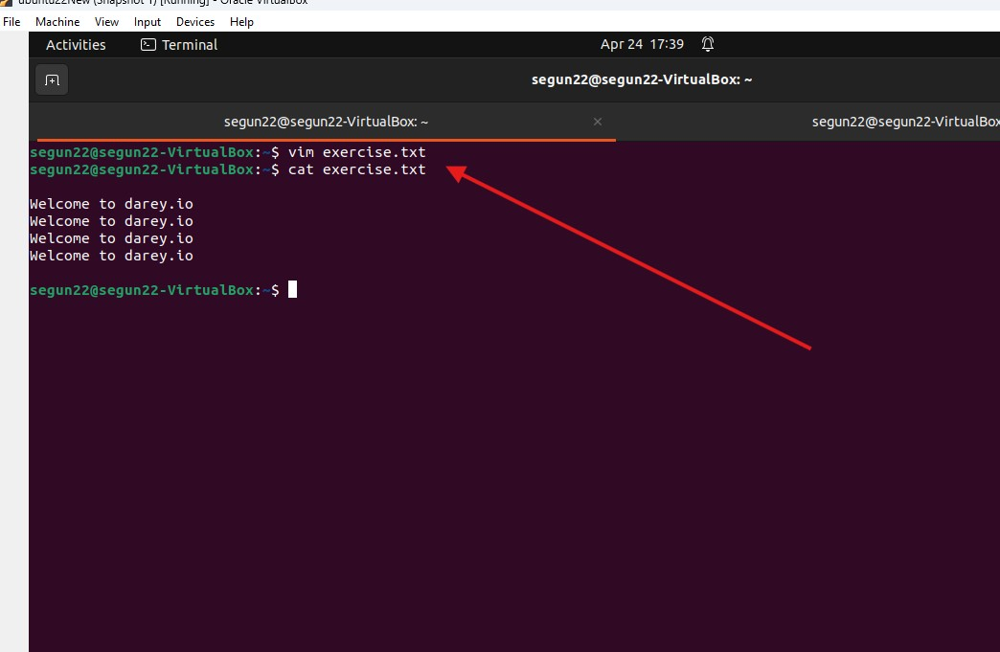

- Step 11 
Screenshot of cmd to enter nano editor session from the terminal with below cmd `nano nano_file.txt`  nano that preceed it means the editor to use is we want the terminal to use is nano and the other text without the txt means name it "nano_file" while the ".txt" means use txt extension we can used other extension like "py" if it is python file we want to.

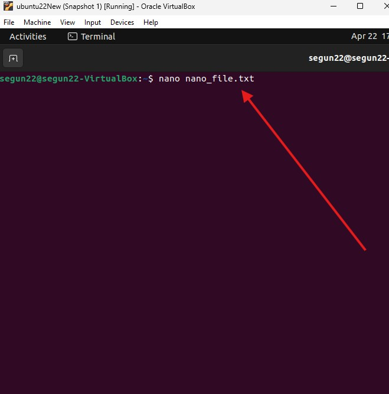

- Step 12
Screenshot of nano text editor with text inside it.

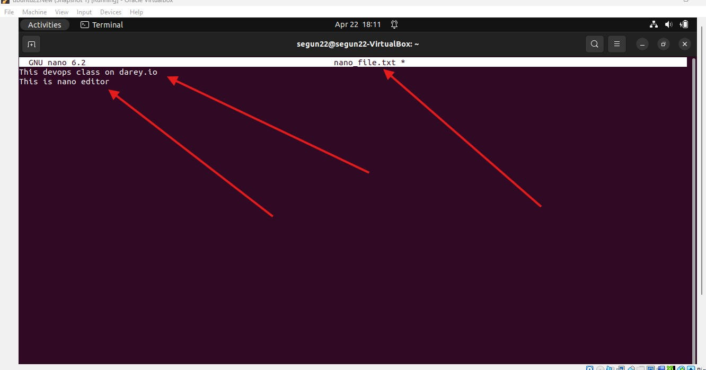

- Step 13
Screenshot of nano text editor renaming the file name with cmd "control o" and inputing the new name with text inside it.

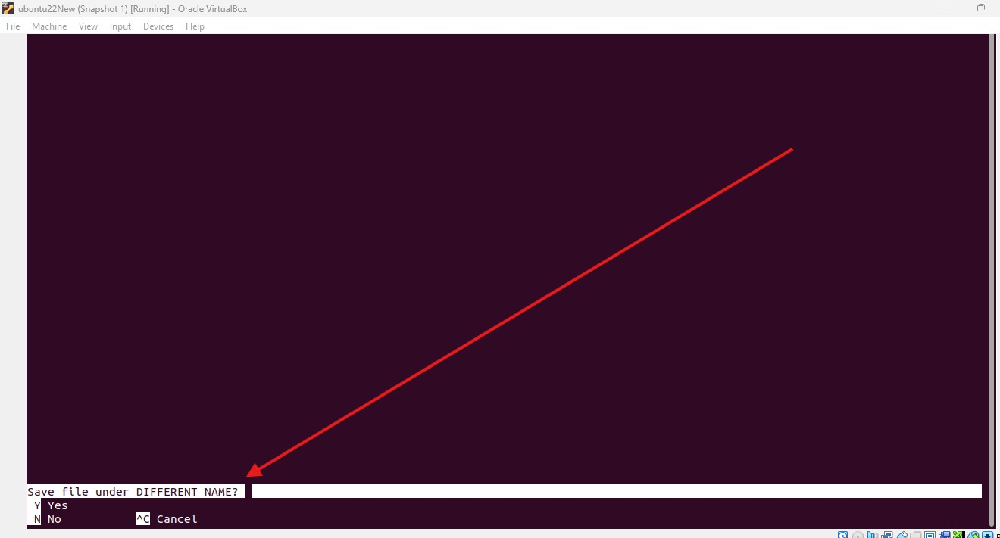

- Step 14
Screenshot of nano text editor saving the file name with cmd "control y" and inputing the new name with text inside it.

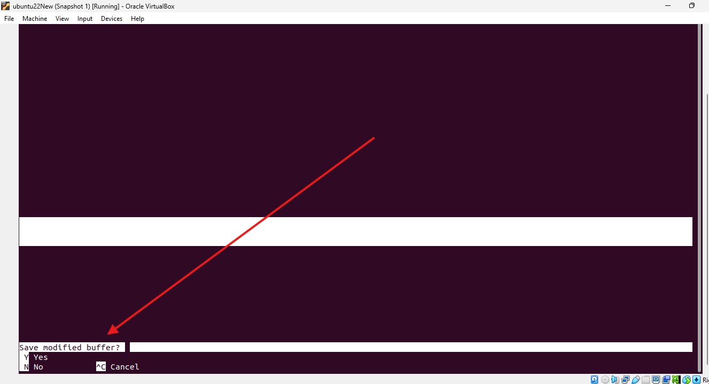

- Step 15
Screenshot of nano text editor rename saved file confirmation from the terminal.

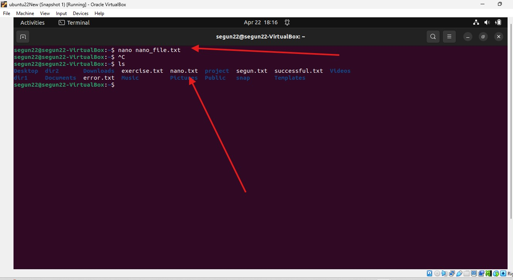
